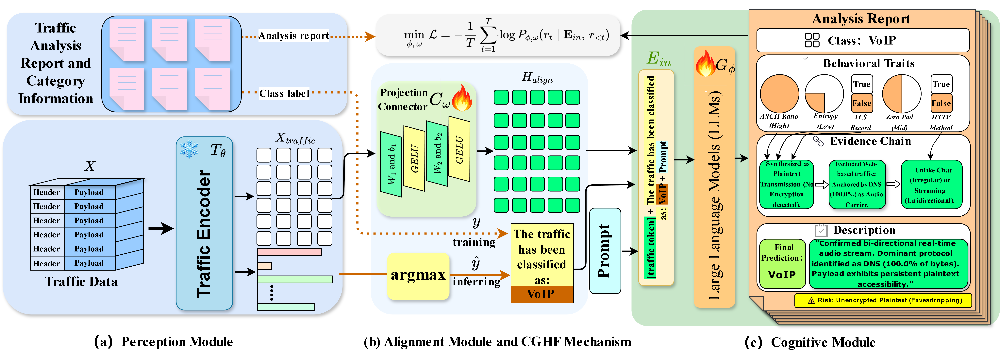
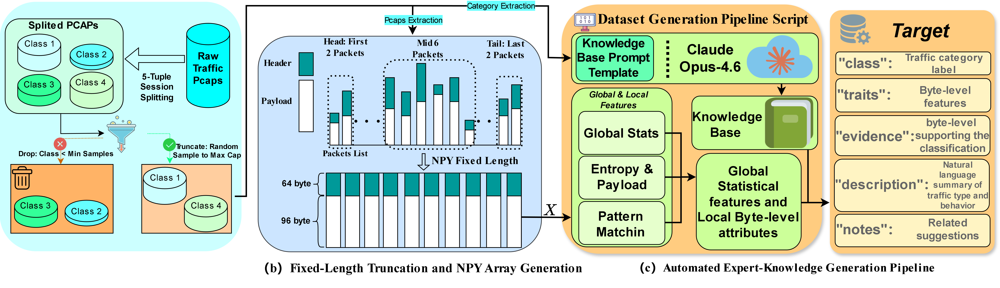

<div align="center">

# 🔐 DTLR

**Multimodal Reasoning with LLM for Encrypted Traffic Interpretation: A Benchmark**

[](https://www.python.org/)
[](https://pytorch.org/)
[](https://www.deepspeed.ai/)
[](LICENSE)
[](.)

<br/>

> 📄 Official implementation of the paper: ***Multimodal Reasoning with LLM for Encrypted Traffic Interpretation: A Benchmark*** (coming soon)

</div>

---

## 📖 Overview

DTLR proposes a **"Perception-before-Cognition"** architecture that decouples encrypted traffic understanding into two sequential stages:

- **Perception**: A frozen NetMamba encoder extracts deep representations from raw traffic byte sequences.
- **Cognition**: A Qwen3-1.7B LLM with LoRA fine-tuning performs traffic classification and generates structured forensic reports including behavioral traits, evidence chains, and risk assessments.

<div align="center">
  
  <p><em>Figure 1: Overall architecture of the DTLR framework.</em></p>
</div>

| Component | Details |
|---|---|
| 🧠 LLM Backbone | Qwen3-1.7B |
| 👁️ Traffic Encoder | NetMamba (frozen) |
| 🔗 Connector | MLP 2× GeLU |
| 🎛️ Fine-tuning | LoRA (r=16, α=16) |
| ⚡ Training Strategy | DeepSpeed ZeRO-2, 4× GPU |

---

## 📦 BGTD: Byte-Grounded Traffic Description Benchmark

### Overview

Existing public traffic datasets provide only raw packet captures paired with coarse-grained categorical labels. While invaluable for discriminative tasks, they fundamentally **lack fine-grained semantic annotations** — such as discriminative behavioral traits, verifiable forensic evidence chains, and expert-level natural language descriptions — that are essential for training and evaluating generative reasoning models.

To bridge this gap, this paper proposes the **Byte-Grounded Traffic Description (BGTD)** benchmark — to the best of our knowledge, **the first benchmark to explicitly pair raw network traffic bytes with structured expert knowledge**. BGTD provides the key foundational data required for multimodal reasoning towards explainable encrypted traffic interpretation.

### Dataset Construction Pipeline

<div align="center">
  
  <p><em>Figure 2: Pipeline of developing BGTD dataset: (a) session extraction and class balancing from raw PCAP files, (b) fixed-length 10×160 NPY array generation via priority-based packet sampling, and (c) LLM-assisted ground-truth synthesis using Claude Opus prompted as a senior network security expert.</em></p>
</div>

**Key design choices:**
- **Temporal Keyframe Preservation**: First 2 and last 2 packets are always retained to capture protocol handshakes and session-end states.
- **Payload-Priority Sampling**: Middle packets are ranked by L4 payload length to prioritize information-rich content.
- **Fixed Representation**: Each flow is normalized to a `10×160` tensor (64-byte header + 96-byte payload per packet), with IP addresses masked and ports bucketed for privacy and generalization.

### Automated Expert-Knowledge Generation

BGTD uses an automated pipeline to generate rich semantic annotations, powered by **Claude Opus**:

1. **Global & Local Feature Extraction**: Per-flow statistics (duration, throughput, dominant protocols) and byte-level attributes (Shannon entropy, ASCII ratio, TLS/HTTP pattern matching) are extracted and discretized into low/mid/high levels.
2. **Expert Knowledge Base Construction**: For each traffic category, an LLM generates protocol hints, behavioral characteristics, and security context.
3. **Multi-field Semantic Label Generation**: Each sample is annotated with 5 structured fields:

| Field | Description |
|---|---|
| `class` | Ground-truth traffic category label |
| `traits` | 5 deterministic byte-level attributes (TLS presence, HTTP tokens, ASCII ratio, entropy, zero-padding) |
| `evidence` | 2–4 verifiable natural language statements grounded in raw byte observations |
| `description` | 2–3 sentence behavioral summary integrating byte observations with expert knowledge |
| `notes` | 1 security-relevant sentence on risk, monitoring strategy, or anomaly indicators |

### Dataset Statistics

BGTD integrates **6 authoritative public traffic repositories**, covering diverse network behaviors, application ecosystems, and encryption protocols:

| Dataset | Traffic Type | Classes | Samples | Download |
|---|---|---|---|---|
| ISCXVPN2016 | VPN encrypted traffic | 7 | 42,000 | [📥 BaiduNetdisk (code: v5u6)](https://pan.baidu.com/s/1HtpaPqpajgFg_zykGp8f8w?pwd=v5u6) |
| ISCX-Tor-2016 | Tor anonymous traffic | 8 | 80,000 | [📥 BaiduNetdisk (code: v5u6)](https://pan.baidu.com/s/1HtpaPqpajgFg_zykGp8f8w?pwd=v5u6) |
| CSTNET-TLS1.3 | TLS 1.3 encrypted web traffic | 120 | 46,372 | [📥 BaiduNetdisk (code: v5u6)](https://pan.baidu.com/s/1HtpaPqpajgFg_zykGp8f8w?pwd=v5u6) |
| USTC-TFC-2016 | Benign & malware traffic | 12 | 66,388 | [📥 BaiduNetdisk (code: v5u6)](https://pan.baidu.com/s/1HtpaPqpajgFg_zykGp8f8w?pwd=v5u6) |
| CrossPlatform (Android) | Cross-platform mobile app traffic | 212 | 38,673 | [📥 BaiduNetdisk (code: v5u6)](https://pan.baidu.com/s/1HtpaPqpajgFg_zykGp8f8w?pwd=v5u6) |
| CrossPlatform (iOS) | Cross-platform mobile app traffic | 196 | 36,535 | [📥 BaiduNetdisk (code: v5u6)](https://pan.baidu.com/s/1HtpaPqpajgFg_zykGp8f8w?pwd=v5u6) |

> All datasets are split into training and test sets at an **8:2 ratio**.

---

## 🛠️ Environment Setup

```bash
conda create -n dtlr python=3.10
conda activate dtlr
pip install -r requirements.txt
```

> ⚠️ **Requirements**: CUDA-capable GPU(s). Training uses **4× GPU** with DeepSpeed ZeRO-2. Inference uses **2× GPU**.

---

## 🚀 Training

```bash
NCCL_P2P_DISABLE=1 NCCL_IB_DISABLE=1 \
deepspeed --num_gpus 4 \
  DTLR_model/tinyllava/train/train.py \
  --deepspeed scripts/zero2.json \
  --model_name_or_path /path/to/Qwen3-1.7B \
  --vision_tower netmamba \
  --vision_tower2 "" \
  --connector_type mlp2x_gelu \
  --data_path /path/to/dataset/train.jsonl \
  --image_folder /path/to/dataset/npy \
  --is_multimodal True \
  --conv_version qwen3_instruct \
  --mm_vision_select_layer -2 \
  --image_aspect_ratio square \
  --fp16 False \
  --bf16 True \
  --training_recipe lora \
  --tune_type_llm lora \
  --tune_type_vision_tower frozen \
  --tune_type_connector full \
  --lora_r 16 \
  --lora_alpha 16 \
  --lora_dropout 0.1 \
  --lora_bias none \
  --per_device_train_batch_size 4 \
  --gradient_accumulation_steps 16 \
  --learning_rate 2e-5 \
  --warmup_ratio 0.1 \
  --weight_decay 0.01 \
  --max_grad_norm 1.0 \
  --num_train_epochs 3 \
  --logging_steps 10 \
  --save_steps 300 \
  --output_dir /path/to/output \
  --report_to none
```

---

## 🔍 Inference

```bash
python DTLR_model/tinyllava/eval/eval_cls_head_qwen_sample_no_LLMclass_mGPU.py \
  --checkpoint_path /path/to/lora/checkpoint \
  --vision_tower_path /path/to/netmamba/checkpoint-best.pth \
  --eval_data_path /path/to/dataset/test.jsonl \
  --image_folder /path/to/dataset/npy \
  --output_dir /path/to/eval_output \
  --samples_per_class 9999999 \
  --batch_size 24 \
  --max_new_tokens 500 \
  --num_gpus 2
```

---

## 📊 Results

Experimental results across all six datasets are reported in the paper.

> 📄 *(Coming soon)*

---

## 📁 Repository Structure

```
DTLR/
├── DTLR_model/
│   └── tinyllava/
│       ├── train/          # Training scripts
│       ├── eval/           # Evaluation scripts
│       └── utils/          # Utility functions
├── scripts/
│   └── zero2.json          # DeepSpeed ZeRO-2 config
├── llavav_model.png        # Architecture figure
├── Dataset_generate.png    # BGTD dataset pipeline figure
├── requirements.txt
└── README.md
```

---

## 📜 Citation

If you find this work useful for your research, please consider citing:

```bibtex
@article{dtlr2025,
  title   = {Multimodal Reasoning with LLM for Encrypted Traffic Interpretation: A Benchmark},
  author  = {Longgang Zhang, Xiaowei Fu, Fuxiang Huang, and Lei Zhang},
  journal = {},
  year    = {2025}
}
```

---

## 📄 License

This project is released under the [MIT License](LICENSE).

---

<div align="center">
⭐ If this work helps your research, please consider giving it a star!
</div>
